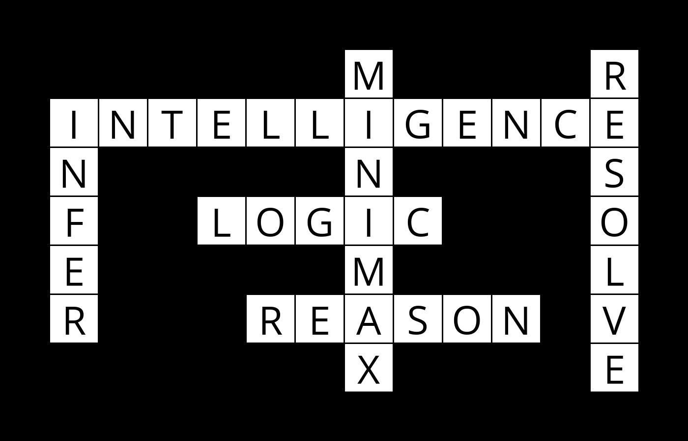
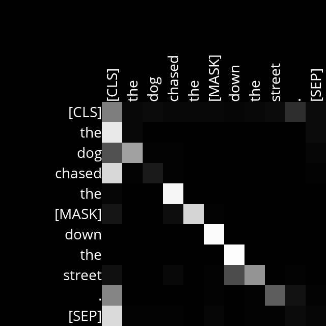
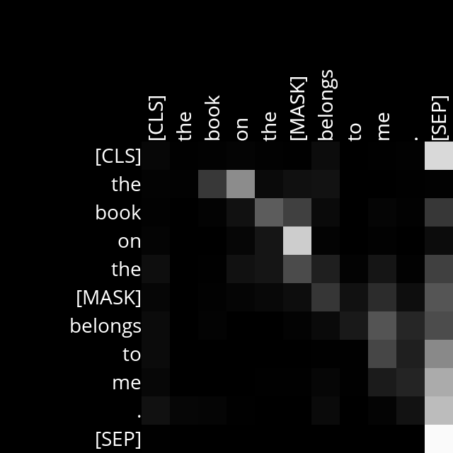

# CS50 AI: Twelve Projects

Portfolio for [CS50's Introduction to Artificial Intelligence with Python](https://cs50.harvard.edu/ai/) (HarvardX).

**Certificate:** https://cs50.harvard.edu/certificates/0d96cd8d-dbff-499c-af78-13aac25e3031

Twelve projects across search, knowledge representation, probabilistic reasoning, optimization, machine learning, neural networks, and natural language. This repository documents what each project does and what it achieved. Solution code is not published here, in line with CS50's academic honesty policy.

---

## Search

### Degrees
Finds the shortest chain of shared films connecting any two actors, using breadth-first search over an IMDb dataset of roughly 100,000 people. Modelled as a graph problem where people are states and films are the actions connecting them.

```
Name: Emma Watson
Name: Jennifer Lawrence
3 degrees of separation.
1: Emma Watson and Daniel Radcliffe starred in Harry Potter and the Deathly Hallows: Part 1
2: Daniel Radcliffe and Woody Harrelson starred in Lost in London
3: Woody Harrelson and Jennifer Lawrence starred in The Hunger Games: Mockingjay - Part 2
```

**Concepts:** breadth-first search, queue frontier, path reconstruction via parent pointers.

### Tic-Tac-Toe
A minimax player that cannot be beaten. Before every move it explores the complete game tree, assuming the opponent plays perfectly, and selects the move whose worst-case outcome is best.

**Result:** never loses. Optimal play against itself always ends in a draw, as game theory predicts.

**Concepts:** minimax, recursive tree search, immutable state via deep copy.

---

## Knowledge

### Knights
Solves Knights and Knaves logic puzzles by encoding them in propositional logic and letting a model checker find the only consistent assignment. The program is given the rules of the puzzle, not the answers, and derives who is lying.

**Concepts:** propositional logic, implication, model checking, entailment.

### Minesweeper
An AI that plays Minesweeper by maintaining a knowledge base of logical sentences of the form "exactly N of these cells are mines", then drawing inferences: any sentence with a count of zero marks its cells safe, any sentence whose count equals its size marks them all mines, and subset relationships between sentences generate entirely new knowledge.

**Result:** 64% win rate over 200 games on an 8x8 board with 8 mines. Losses occur only in positions where no safe move is logically provable and a guess is required.

**Concepts:** knowledge representation, inference, constraint propagation.

---

## Uncertainty

### PageRank
Google's original ranking algorithm, implemented two independent ways: by simulating a random web surfer across 10,000 samples, and by iterating the PageRank formula to convergence. The two methods agree to within a few thousandths, which is a useful check that both are correct.

```
PageRank Results from Sampling (n = 10000)
  1.html: 0.2180   2.html: 0.4318   3.html: 0.2195   4.html: 0.1307
PageRank Results from Iteration
  1.html: 0.2198   2.html: 0.4294   3.html: 0.2198   4.html: 0.1311
```

**Concepts:** Markov chains, damping factor, iterative convergence, sampling.

### Heredity
A Bayesian network that infers how many copies of a mutated gene each family member carries, given only which relatives display an observable trait. Handles arbitrary family structures including multi-generation trees, accounting for inheritance probability and mutation.

**Concepts:** Bayesian networks, joint probability, conditional probability, normalization.

---

## Optimization

### Crossword
Generates complete crossword puzzles by treating each word slot as a variable and each word list as its domain. Enforces node consistency (word length), then AC-3 arc consistency (matching letters at intersections), then backtracking search guided by the minimum remaining values and least constraining value heuristics.



**Result:** solves a puzzle with 2,654 initial candidate values in 0.09 seconds. Arc consistency alone eliminates roughly 80% of the search space before any guessing begins.

**Concepts:** constraint satisfaction, node and arc consistency, AC-3, backtracking search, heuristics.

---

## Learning

### Shopping
A k-nearest-neighbor classifier predicting whether an online shopper will complete a purchase, trained on 12,330 real browsing sessions with 17 features each.

**Result:** 90% specificity, 40% sensitivity. Measuring both matters here: a model that simply predicted "no purchase" every time would score 85% on raw accuracy while being useless, which is exactly what sensitivity exposes.

**Concepts:** k-nearest neighbors, feature engineering, sensitivity and specificity, class imbalance.

### Nim
A reinforcement learning agent that starts with no knowledge of Nim strategy and learns to play optimally by playing 10,000 games against itself, updating Q-values for every state-action pair it encounters.

```
Piles: [1, 3, 5, 7]
AI  takes 1 from pile 0  ->  [0, 3, 5, 7]
Rnd takes 4 from pile 3  ->  [0, 3, 5, 3]
AI  takes 5 from pile 2  ->  [0, 3, 0, 3]
Rnd takes 2 from pile 3  ->  [0, 3, 0, 1]
AI  takes 3 from pile 1  ->  [0, 0, 0, 1]
Rnd takes 1 from pile 3  ->  [0, 0, 0, 0]
Winner: AI
```

**Result:** 2,427 learned state-action values. 500 wins from 500 games against a random opponent, playing both first and second.

**Concepts:** Q-learning, reward propagation, epsilon-greedy exploration, learning rate.

---

## Neural Networks

### Traffic
A convolutional neural network classifying German road signs into 43 categories, trained on 26,640 images from the GTSRB dataset.

**Result:** 98.7% test accuracy.

The instructive part was the failure. My first model reached only 5.45% accuracy, barely above the 2.3% you would get by guessing, with a starting loss of 158 where a healthy value is around 3.76. The cause was unnormalized input: raw pixel values from 0 to 255 pushed the network into saturation. Adding a single rescaling layer took it from 5.45% to 96.19%.

Architecture comparison, all trained for 10 epochs:

| Configuration | Test accuracy | Test loss |
| --- | --- | --- |
| No normalization | 5.45% | 3.4917 |
| Normalized baseline | 96.19% | 0.1471 |
| 64 filters | 96.60% | 0.1565 |
| **Two conv/pool blocks** | **98.70%** | **0.0484** |
| No dropout | 96.33% | 0.1753 |
| 256-unit dense layer | 97.55% | 0.1064 |

The no-dropout run is worth noting: it produced the highest training accuracy of any model at 98.82% while scoring among the lowest on test data, which is overfitting in its clearest form.

**Concepts:** convolutional layers, pooling, dropout, normalization, overfitting.

---

## Language

### Parser
A context-free grammar that parses English sentences into syntax trees and extracts noun phrase chunks. Handles adjective stacking, prepositional phrases, conjoined clauses, and prepositions that take entire subordinate clauses, while rejecting malformed input such as "the the armchair".

```
        S
   _____|___
  NP        VP
  |         |
  N         V
  |         |
holmes     sat
```

**Concepts:** context-free grammars, recursive grammar rules, syntax trees, chunking.

### Attention
Uses BERT to predict masked words and visualizes all 144 self-attention heads (12 layers, 12 heads each) to investigate what the model has learned to attend to.

Layer 4, Head 6 attends to the token immediately preceding each token. The bright band just below the diagonal is the signature:



Layer 5, Head 6 links prepositions to the nouns they govern. In the row for "on", the brightest cell is its object:



**Concepts:** transformers, self-attention, masked language modelling, attention visualization.

---

## Stack

Python 3.12, TensorFlow, scikit-learn, OpenCV, NLTK, Hugging Face Transformers, Pillow.

## Note on code

Per CS50's academic honesty policy, solution code for these projects is not published publicly. Happy to walk through any implementation in detail on request.
